# Documentación de API de Gestión de Clientes

Este proyecto es un servicio web Restful para la gestión de clientes. Utilizando java y el framework quarkus como tecnologías 
principales.

---

## Índice

- [Descripción general](#descripción-general)
- [Configuración y uso del servicio](#configuración-y-uso-del-servicio)
    - [Requisitos](#requisitos)
    - [Primeros pasos](#primeros-pasos)
    - [Creación de tabla en la base de datos](#creación-de-tabla-en-la-base-de-datos)
    - [Configurar el proyecto](#configurar-el-proyecto)
    - [Ejecución del proyecto](#ejecución-del-proyecto)
    - [Ejecución de pruebas](#ejecución-de-pruebas)
- [Endpoints del servicio](#endpoints-del-servicio)
    - [Crear un nuevo cliente](#crear-un-nuevo-cliente)
    - [Obtener todos los clientes](#obtener-todos-los-clientes)
    - [Obtener clientes por el país](#obtener-clientes-por-el-país)
    - [Obtener cliente por su ID](#obtener-cliente-por-su-id)
    - [Actualizar datos de un cliente](#actualizar-datos-de-un-cliente)
    - [Actualizar parcialmente datos de un cliente](#actualizar-parcialmente-datos-de-un-cliente)
    - [Eliminar un cliente](#eliminar-un-cliente)
    - [Respuestas de error](#respuestas-de-error)
- [Decisiones de diseño](#decisiones-de-diseño)
    - [Uso de arquitectura limpia y buenas prácticas](#uso-de-arquitectura-limpia-y-buenas-prácticas)
    - [Uso del patrón repository](#uso-del-patron-repository)
    - [Manejo de errores](#manejo-de-errores)
    - [Uso del API RestCountries para obtener gentilicios](#uso-del-api-restcountries-para-obtener-gentilicios)
    - [Uso de DTOs](#uso-de-dtos)
    - [Herramientas utilizadas](#herramientas-utilizadas)
- [Diagramas](#diagramas)
    - [Diagrama de arquitectura general](#diagrama-de-arquitectura-general)
    - [Diagrama de arquitectura general con inversión de dependencias](#diagrama-de-arquitectura-general-con-inversión-de-dependencias)
    - [Diagrama de arquitectura general con dependencias detalladas](#diagrama-de-arquitectura-general-con-dependencias-detalladas)
    - [Diagrama de arquitectura general con dependencias detalladas y inversión de dependencias](#diagrama-de-arquitectura-general-con-dependencias-detalladas-y-inversión-de-dependencias)
    - [Interacciones entre componentes](#interacciones-entre-componentes)
    - [Interacciones de subproceso](#interacciones-de-subproceso)
    - [Interacciones en validar correo existe (subproceso)](#interacciones-en-validar-correo-existe-subproceso)
    - [Interacciones en obtener cliente por ID (subproceso)](#interacciones-en-obtener-cliente-por-id-subproceso)
    - [Interacciones en creación de clientes](#interacciones-en-creación-de-clientes)
    - [Interacciones en obtener todos los clientes](#interacciones-en-obtener-todos-los-clientes)
    - [Interacciones en obtener todos los clientes por país](#interacciones-en-obtener-todos-los-clientes-por-país)
    - [Interacciones en obtener cliente por ID](#interacciones-en-obtener-cliente-por-id)
    - [Interacciones en actualizar cliente por ID](#interacciones-en-actualizar-cliente-por-id)
    - [Interacciones en parchear (actualizar parcial) cliente por ID](#interacciones-en-parchear-actualizar-parcial-cliente-por-id)
    - [Interacciones eliminar cliente por ID](#interacciones-eliminar-cliente-por-id)
- [Autor y fecha](#autor-alcides-polanco-german)

---

## Descripción general

El servicio permite a una empresa **gestionar sus clientes** los cuales serán guardados en una base de datos. Entre las 
operaciones que permiten están el crear cliente, buscar clientes, editar y eliminar clientes.

### Funciones principales

- Crear un nuevo cliente.
- Obtener todos los clientes.
- Obtener clientes según el país.
- Obtener un cliente por su ID.
- Actualizar datos de los clientes (correo, direccion, telefono y pais)
- Eliminar un cliente por su ID.

---

## Configuración y uso del servicio

### Requisitos

- Java JDK 17 o versiones superiores.
- Maven 3.9.1 o versiones superiores.
- Base de datos tipo SQL (Recomiendo el uso de PostgreSQL).
- Puertos **8080** y **8081** libres (pueden cambiarse, se muestra en la parte de configuración como hacerlo).

---

### Primeros pasos

### Clonar el proyecto 

```bash 
  git clone https://github.com/AlcidesPoG/clientes-api.git
```
Una vez tenga el proyecto clonado, ingrese al mismo para proceder a configurar el proyecto.

---

### Creación de tabla en la base de datos

En los requerimientos se especifica que se debe usar una base de datos, recomiendo el uso de PostgreSQL pero
puede usar la base de datos **tipo SQL** de su preferencia a continuación dejo el query de creación la tabla que se 
usó en el proyecto (Este query fue escrito en PostgreSql).

```postgresql
create table cliente (
     id bigint primary key generated always as IDENTITY,
     primer_nombre varchar(50) not null,
     segundo_nombre varchar(50) null,
     primer_apellido varchar(50) not null,
     segundo_apellido varchar(50) null,
     correo varchar(320) not null  unique,
     direccion varchar(500) not null,
     telefono varchar(20) not null,
     pais varchar(3) not null,
     gentilicio varchar(255) null
)

```
> **Nota**: En caso de usar una base de datos diferente a PostgreSQL, es posible que deba cambiar algunos campos como 
> el cómo se genera el `id` int con identity. Es importante que los campos de texto admitan UTF-8 para permitir acentos
> y la letra ñ.
---

### Configurar el proyecto

Ingrese al archivo `application.properties` para la configuración del proyecto. A continuación se muestra un ejemplo 
de la configuración.

```properties
#configuración de tu base de datos
#Este es solo un valor de ejemplo
quarkus.datasource.db-kind=postgresql
quarkus.datasource.username=Tu_usuario
quarkus.datasource.password=Tu_contraseña
#Este es solo un valor de ejemplo
quarkus.datasource.jdbc.url= jdbc:postgresql://localhost:5432/tu_base_de_datos

#Configuración de una base de datos para las pruebas (Ya está configurada, no requiere cambios)
%test.quarkus.datasource.db-kind=h2
%test.quarkus.datasource.jdbc.url=jdbc:h2:mem:testdb;DB_CLOSE_DELAY=-1
%test.quarkus.datasource.username=sa
%test.quarkus.datasource.password=sa

#Cambio del puerto donde correra Quarkus (Opcional)
#(recomiendo usarlo solo si 8080 y 8081 están ocupados)
#Este es solo un valor de ejemplo
quarkus.http.port=7575 
#Este es solo un valor de ejemplo
%test.quarkus.http.port=7576

# Habilitar Swagger UI (Opcional, es una documentacion automatica del proyecto, fácil de usar)
quarkus.swagger-ui.always-include=true
```

> **Nota:**
> Si desea utilizar otra base de datos tipo SQL diferente a PostgreSQL, tendra que instalar la extension de la base de datos que
> corresponde con Quarkus y JDBC. Por ejemplo:
>  ```bash 
> ./mvnw quarkus:add-extension -Dextensions="jdbc-mysql"
>```
> > Enlace a la documentacion de quarkus: https://es.quarkus.io/guides/datasource

> **Advertencia:** La base de datos `H2` se usa en el entorno de prueba y tiene un scope de test en el pom.xml, 
> por lo que no será utilizable en otros entornos aparte del de pruebas. Si se desea usarla en el entorno de desarrollo, 
> se debe remover el scope de test en el pom.xml (preferiblemente utilizar otra base de datos para mantener la 
> integridad de las pruebas).

## Ejecución del proyecto

Luego de configurar el archivo `application.properties`, puedes iniciar la aplicación con los siguientes comandos en consola:
```bash
  ./mvnw quarkus:dev
```
Para el modo producción, se deben ejecutar los siguientes comandos en orden:

```bash
  ./mvnw package
```

```bash
  ./mvnw quarkus:run
```

Estos comandos ejecutarán el proyecto  `dev` para desarrollo y `run` para produccion, ambos descargarán dependencias
faltantes en caso de ser necesario.

## Ejecución de pruebas

Para ejecutar las pruebas unitarias y pruebas de integracion del proyecto usar el siguiente comando:

```bash
   ./mvnw test
```

Quarkust ejecutará, todas las pruebas y si todo sale bien deberían ver algo como:

```yaml
  [INFO] Results:
  [INFO] Tests run: 35, Failures: 0, Errors: 0, Skipped: 0
  [INFO] ------------------------------------------------------------------------
  [INFO] BUILD SUCCESS
  [INFO] ------------------------------------------------------------------------
```

## Endpoints del servicio

A continuación se muestran los principales endpoints disponibles en la API y para qué sirven. Todos los endpoints 
aceptan y retornan datos en el formato **JSON**.

**URL base:** [`http://localhost:8080/`](http://localhost:8080/)

Para fácilitar el uso del API también está autodocumentada por swagger, mediante la url:

**URL para usar documentacion swagger:** [`http://localhost:8080/q/swagger-ui/`](http://localhost:8080/q/swagger-ui/)

>Nota: Si cambio el puerto que usa Quarkus, deberá usar el puerto asígnado.

| Método   | Endpoint                      | Descripción                                                                                              | Códigos de respuesta                         |
|----------|-------------------------------|----------------------------------------------------------------------------------------------------------|----------------------------------------------|
| `POST`   | `/clientes`                   | Crear un nuevo cliente.                                                                                  | `201 Created`, `400 Bad Request`             |
| `GET`    | `/clientes`                   | Obtener todos los clientes.                                                                              | `200 OK`                                     |
| `GET`    | `/clientes/pais/{codigoPais}` | Obtener clientes que pertenecen a un país específico (El código debe estar en formato ISO 3166 Alpha-3). | `200 OK`                                     |
| `GET`    | `/clientes/{id}`              | Obtener un cliente específico por su identificador.                                                      | `200 OK`, `404 Not Found`                    |
| `PUT`    | `/clientes/{id}`              | Actualizar todos los campos: correo, direccion, telefono o pais de un cliente.                           | `200 OK`, `400 Bad Request`, `404 Not Found` |
| `PATCH`  | `/clientes/{id}`              | Actualizar parcialmente, uno o mas de los campos: correo, direccion, telefono o pais de un cliente.      | `200 OK`, `400 Bad Request`, `404 Not Found` |
| `DELETE` | `/clientes/{id}`              | Eliminar un cliente por su identificador.                                                                | `204 No Content`, `404 Not Found`            |

### Guia de usos de Endpoint

### Crear un nuevo cliente

Este es el endpoint encargado de crear un cliente.

**Método**:`POST` **Endpoint:**`http://localhost:8080/clientes`

### Parámetros de solicitud (formato json)

| Campo             | Tipo         | Obligatorio | Descripción                                                              |
|-------------------|--------------|-------------|--------------------------------------------------------------------------|
| `primerNombre`    | String (50)  | Sí          | Primer nombre del cliente.                                               |
| `segundoNombre`   | String (50)  | No          | Segundo nombre (opcional).                                               |
| `primerApellido`  | String (50)  | Sí          | Primer apellido del cliente.                                             |
| `segundoApellido` | String (50)  | No          | Segundo apellido (opcional).                                             |
| `correo`          | String (320) | Sí          | Correo electrónico del cliente. Debe ser válido y único.                 |
| `direccion`       | String (500) | Sí          | Dirección del cliente.                                                   |
| `telefono`        | String (20)  | Sí          | Teléfono del cliente.                                                    |
| `pais`            | String (3)   | sí          | Código de país en formato ISO 3166 Alpha-3 (por ejemplo, "DOM" o "USA"). |
---

### Respuesta de solicitud

Un objeto con los datos del cliente:

| Campo             | Tipo         | Descripción                                                       |
|-------------------|--------------|-------------------------------------------------------------------|
| `id`              | int          | Identificador unico.                                              |
| `primerNombre`    | String (50)  | Primer nombre del cliente.                                        |
| `segundoNombre`   | String (50)  | Segundo nombre (opcional).                                        |
| `primerApellido`  | String (50)  | Primer apellido del cliente.                                      |
| `segundoApellido` | String (50)  | Segundo apellido (opcional).                                      |
| `correo`          | String (320) | Correo electrónico del cliente. Debe ser válido y único.          |
| `direccion`       | String (500) | Dirección del cliente.                                            |
| `telefono`        | String (20)  | Teléfono del cliente.                                             |
| `pais`            | String (3)   | Código de país en formato ISO 3166.                               | 
| `gentilicio`      | String (255) | Gentilicio del país del cliente, obtenido de un servicio externo. |
---
#### Ejemplo de solicitud

`POST` `http://localhost:8080/clientes`

```json
{
  "primerNombre": "Juan",
  "segundoNombre": "Luis",
  "primerApellido": "Pérez",
  "segundoApellido": "Gomez",
  "correo": "juan@test.com",
  "direccion": "Calle 1",
  "telefono": "8091234567",
  "pais": "DOM"
}
```
---

#### Ejemplo de respuesta

**Código HTTP:** `201 Created`

```json
{
  "id": 1,
  "primerNombre": "Juan",
  "segundoNombre": "Luis",
  "primerApellido": "Perez",
  "segundoApellido": "Gomez",
  "correo": "juan@test.com",
  "direccion": "Calle 1",
  "telefono": "8091234567",
  "pais": "DOM",
  "gentilicio": "Masculino: Dominican / Femenino: Dominican"
}
```
---

### Obtener todos los clientes

Este es el endpoint encargado de retornar una lista con todos los clientes.

**Método**:`GET` **Endpoint:**`http://localhost:8080/clientes`

### Respuesta de solicitud

Una lista de datos de clientes:

| Campo             | Tipo         | Descripción                                                       |
|-------------------|--------------|-------------------------------------------------------------------|
| `id`              | int          | Identificador unico.                                              |
| `primerNombre`    | String (50)  | Primer nombre del cliente.                                        |
| `segundoNombre`   | String (50)  | Segundo nombre (opcional).                                        |
| `primerApellido`  | String (50)  | Primer apellido del cliente.                                      |
| `segundoApellido` | String (50)  | Segundo apellido (opcional).                                      |
| `correo`          | String (320) | Correo electrónico del cliente. Debe ser válido y único.          |
| `direccion`       | String (500) | Dirección del cliente.                                            |
| `telefono`        | String (20)  | Teléfono del cliente.                                             |
| `pais`            | String (3)   | Código de país en formato ISO 3166 Alpha-3.                       | 
| `gentilicio`      | String (255) | Gentilicio del país del cliente, obtenido de un servicio externo. |
---

#### Ejemplo de solicitud

`GET` `http://localhost:8080/clientes`

#### Ejemplo de respuesta

**Código HTTP:** `200 Ok`

```json
[
  {
    "id": 1,
    "primerNombre": "Juan",
    "segundoNombre": "Luis",
    "primerApellido": "Perez",
    "segundoApellido": "Gomez",
    "correo": "juan@test.com",
    "direccion": "Calle 1",
    "telefono": "8091234567",
    "pais": "DOM",
    "gentilicio": "Masculino: Dominican / Femenino: Dominican"
  },
  {
    "id": 2,
    "primerNombre": "Ana",
    "primerApellido": "Rodriguez",
    "correo": "ana@correo.com",
    "direccion": "Calle 2",
    "telefono": "8092223344",
    "pais": "USA",
    "gentilicio": "Masculino: American / Femenino: American"
  } 
  ...
]
```
---

### Obtener clientes por el país

Este es el endpoint encargado de retornar una lista de clientes que pertenecen a un país específico.

**Método**:`GET` **Endpoint:**`http://localhost:8080/clientes/pais/{codigoPais}`

### Parámetros de ruta

| Parámetro    | Tipo       | Obligatorio | Descripción                                                                      |
|--------------|------------|-------------|----------------------------------------------------------------------------------|
| `codigoPais` | String (3) | Sí          | Código del país en formato ISO 3166 Alpha-3 (por ejemplo, "DOM", "USA" o "MEX"). |

---

### Respuesta de solicitud

Una lista de datos de clientes:

| Campo             | Tipo         | Descripción                                                              |
|-------------------|--------------|--------------------------------------------------------------------------|
| `id`              | int          | Identificador único.                                                     |
| `primerNombre`    | String (50)  | Primer nombre del cliente.                                               |
| `segundoNombre`   | String (50)  | Segundo nombre (opcional).                                               |
| `primerApellido`  | String (50)  | Primer apellido del cliente.                                             |
| `segundoApellido` | String (50)  | Segundo apellido (opcional).                                             |
| `correo`          | String (320) | Correo electrónico del cliente. Debe ser válido y único.                 |
| `direccion`       | String (500) | Dirección del cliente.                                                   |
| `telefono`        | String (20)  | Teléfono del cliente.                                                    |
| `pais`            | String (3)   | Código de país en formato ISO 3166 Alpha-3 (por ejemplo, "DOM" o "USA"). |
| `gentilicio`      | String (255) | Gentilicio del país del cliente, obtenido desde un servicio externo.     |

---

#### Ejemplo de solicitud

`GET` `http://localhost:8080/clientes/pais/DOM`

---

#### Ejemplo de respuesta

**Código HTTP:** `200 Ok`

```json
[
  {
    "id": 1,
    "primerNombre": "Juan",
    "segundoNombre": "Luis",
    "primerApellido": "Perez",
    "segundoApellido": "Gomez",
    "correo": "juan@test.com",
    "direccion": "Calle 1",
    "telefono": "8091234567",
    "pais": "DOM",
    "gentilicio": "Masculino: Dominican / Femenino: Dominican"
  },
  {
    "id": 2,
    "primerNombre": "Miguel",
    "primerApellido": "Sanchez",
    "correo": "Miguel@Sanchez.com",
    "direccion": "Calle 2",
    "telefono": "8092223344",
    "pais": "DOM",
    "gentilicio": "Masculino: Dominican / Femenino: Dominican"
  }
]
```
---

### Obtener cliente por su ID

Este es el endpoint encargado de retornar la información completa de un cliente específico usando su identificador único.

**Método**:`GET` **Endpoint:**`http://localhost:8080/clientes/{id}`

---

### Parámetros de ruta

| Parámetro | Tipo | Obligatorio | Descripción                      |
|-----------|------|-------------|----------------------------------|
| `id`      | int  | Sí          | Identificador único del cliente. |

---

### Respuesta de solicitud

Un objeto con los datos del cliente:

| Campo             | Tipo         | Descripción                                                              |
|-------------------|--------------|--------------------------------------------------------------------------|
| `id`              | int          | Identificador único.                                                     |
| `primerNombre`    | String (50)  | Primer nombre del cliente.                                               |
| `segundoNombre`   | String (50)  | Segundo nombre (opcional).                                               |
| `primerApellido`  | String (50)  | Primer apellido del cliente.                                             |
| `segundoApellido` | String (50)  | Segundo apellido (opcional).                                             |
| `correo`          | String (320) | Correo electrónico del cliente. Debe ser válido y único.                 |
| `direccion`       | String (500) | Dirección del cliente.                                                   |
| `telefono`        | String (20)  | Teléfono del cliente.                                                    |
| `pais`            | String (3)   | Código de país en formato ISO 3166 Alpha-3 (por ejemplo, "DOM" o "USA"). |
| `gentilicio`      | String (255) | Gentilicio del país del cliente, obtenido desde un servicio externo.     |

---

#### Ejemplo de solicitud

`GET` `http://localhost:8080/clientes/1`

---

### Ejemplo de respuesta

**Código HTTP:** `200 Ok`

```json
{
  "id": 1,
  "primerNombre": "Juan",
  "segundoNombre": "Luis",
  "primerApellido": "Perez",
  "segundoApellido": "Gomez",
  "correo": "juan@test.com",
  "direccion": "Calle 1",
  "telefono": "8091234567",
  "pais": "DOM",
  "gentilicio": "Masculino: Dominican / Femenino: Dominican"
}
```

### Actualizar datos de un cliente

Este es el endpoint encargado de actualizar la información de un cliente ya registrado por su 
identificador unico. Solo se pueden modificar los campos: **correo, direccion, telefono y pais** 
(Actualizar el país actualizará automaticamente el gentilicio).

**Método**:`PUT` **Endpoint:**`http://localhost:8080/clientes/{id}`

> **Nota**: En este todos los parámetros son obligatorio, para actualizacion parcial usar Patch, se encuentra más abajo.

---

### Parámetros de ruta

| Parámetro | Tipo | Obligatorio | Descripción                      |
|-----------|------|-------------|----------------------------------|
| `id`      | int  | Sí          | Identificador único del cliente. |

---

### Parámetros de solicitud (formato json)

| Campo       | Tipo         | Obligatorio | Descripción                                                                    |
|-------------|--------------|-------------|--------------------------------------------------------------------------------|
| `correo`    | String (320) | Sí          | Nuevo correo electrónico del cliente. Debe ser válido y único.                 |
| `direccion` | String (500) | Sí          | Nueva dirección del cliente.                                                   |
| `telefono`  | String (20)  | Sí          | Nuevo número de teléfono                                                       |
| `pais`      | String (3)   | Sí          | Nuevo código de país en formato ISO 3166 Alpha-3 (por ejemplo, "DOM" o "USA"). |

---

### Respuesta de solicitud

Un objeto con los datos del cliente:

| Campo             | Tipo         | Descripción                                                              |
|-------------------|--------------|--------------------------------------------------------------------------|
| `id`              | int          | Identificador único.                                                     |
| `primerNombre`    | String (50)  | Primer nombre del cliente.                                               |
| `segundoNombre`   | String (50)  | Segundo nombre (opcional).                                               |
| `primerApellido`  | String (50)  | Primer apellido del cliente.                                             |
| `segundoApellido` | String (50)  | Segundo apellido (opcional).                                             |
| `correo`          | String (320) | Correo electrónico del cliente. Debe ser válido y único.                 |
| `direccion`       | String (500) | Dirección del cliente.                                                   |
| `telefono`        | String (20)  | Teléfono del cliente.                                                    |
| `pais`            | String (3)   | Código de país en formato ISO 3166 Alpha-3 (por ejemplo, "DOM" o "USA"). |
| `gentilicio`      | String (255) | Gentilicio del país del cliente, obtenido desde un servicio externo.     |

---

#### Ejemplo de solicitud

`PUT` `http://localhost:8080/clientes/1`

```json
{
  "correo": "juan.perez@ejemplo.com",
  "direccion": "Calle 15",
  "telefono": "8091111111",
  "pais": "MEX"
}
```
---

#### Ejemplo de respuesta

**Código HTTP:** `200 Ok`

```json
{
  "id": 1,
  "primerNombre": "Juan",
  "segundoNombre": "Luis",
  "primerApellido": "Perez",
  "segundoApellido": "Gomez",
  "correo": "juan.perez@ejemplo.com",
  "direccion": "Calle 15",
  "telefono": "8091111111",
  "pais": "MEX",
  "gentilicio": "Masculino: Mexican / Femenino: Mexican"
}
```

---

### Actualizar parcialmente datos de un cliente

Este es el endpoint encargado de actualizar parcialmente (parchear) la información de un cliente ya registrado por su
identificador unico. Solo se pueden modificar los campos: **correo, dirección, telefono y pais**
(Actualizar el país actualizará automaticamente el gentilicio).

**Método**:`PATCH` **Endpoint:**`http://localhost:8080/clientes/{id}`

---

### Parámetros de ruta

| Parámetro | Tipo | Obligatorio | Descripción                      |
|-----------|------|-------------|----------------------------------|
| `id`      | int  | Sí          | Identificador único del cliente. |

---

### Parámetros de solicitud (formato json)

| Campo       | Tipo         | Obligatorio | Descripción                                                                    |
|-------------|--------------|-------------|--------------------------------------------------------------------------------|
| `correo`    | String (320) | No          | Nuevo correo electrónico del cliente. Debe ser válido y único.                 |
| `direccion` | String (500) | No          | Nueva dirección del cliente.                                                   |
| `telefono`  | String (20)  | No          | Nuevo número de teléfono                                                       |
| `pais`      | String (3)   | No          | Nuevo código de país en formato ISO 3166 Alpha-3 (por ejemplo, "DOM" o "USA"). |

---

### Respuesta de solicitud

Un objeto con los datos del cliente:

| Campo             | Tipo         | Descripción                                                              |
|-------------------|--------------|--------------------------------------------------------------------------|
| `id`              | int          | Identificador único.                                                     |
| `primerNombre`    | String (50)  | Primer nombre del cliente.                                               |
| `segundoNombre`   | String (50)  | Segundo nombre (opcional).                                               |
| `primerApellido`  | String (50)  | Primer apellido del cliente.                                             |
| `segundoApellido` | String (50)  | Segundo apellido (opcional).                                             |
| `correo`          | String (320) | Correo electrónico del cliente. Debe ser válido y único.                 |
| `direccion`       | String (500) | Dirección del cliente.                                                   |
| `telefono`        | String (20)  | Teléfono del cliente.                                                    |
| `pais`            | String (3)   | Código de país en formato ISO 3166 Alpha-3 (por ejemplo, "DOM" o "USA"). |
| `gentilicio`      | String (255) | Gentilicio del país del cliente, obtenido desde un servicio externo.     |

---

#### Ejemplo de solicitud

`PATCH` **Endpoint:**`http://localhost:8080/clientes/1`

```json
{
  "correo": "juan.perez@ejemplo.com",
  "direccion": "Calle 15",
  "pais": "MEX"
}
```
---

#### Ejemplo de respuesta

**Código HTTP:** `200 Ok`

```json
{
  "id": 1,
  "primerNombre": "Juan",
  "segundoNombre": "Luis",
  "primerApellido": "Perez",
  "segundoApellido": "Gomez",
  "correo": "juan.perez@ejemplo.com",
  "direccion": "Calle 15",
  "telefono": "8090000000",
  "pais": "MEX",
  "gentilicio": "Masculino: Mexican / Femenino: Mexican"
}
```

---

#### Eliminar un cliente

Este es el endpoint encargado de eliminar un cliente específico de la base de datos por su identificador único.

**Método**:`DELETE` Endpoint:`http://localhost:8080/clientes/{id}`

---

### Parámetros de ruta

| Parámetro | Tipo | Obligatorio | Descripción |
|------------|------|-------------|--------------|
| `id`       | int  | Sí | Identificador único del cliente que se desea eliminar. |

---

### Respuesta de solicitud

Este endpoint **no retorna un cuerpo en la respuesta**.  

---

#### Ejemplo de solicitud

`DELETE` `http://localhost:8080/clientes/1`

---

### Ejemplo de respuesta

**Código HTTP:** `204 No Content`

---

### Respuestas de error

Cuando ocurra un error, el sistema devolvera un código de error, según el tipo de error y mensajes
con la siguiente estructura:

### Error 400 Bad Request

Ocurre cuando los datos enviados no cumplen las validaciónes establecidas.

```json
{
  "mensaje": "Errores de validación",
  "codigoError": 400,
  "fecha": "fecha y hora del error",
  "detalles": [
    "crear.request.primerNombre: El primer nombre es obligatorio",
    "crear.request.primerApellido: El primer apellido es obligatorio",
    "crear.request.correo: El correo es obligatorio",
    "crear.request.direccion: La direccion es obligatoria",
    "crear.request.telefono: El telefono es obligatorio",
    "crear.request.pais: El pais es obligatorio"
  ]
}
```
---

### Error 400 Bad Request

Ocurre si se intenta crear o actualizar a un correo ya registrado (Duplicado).

```json
{
"mensaje": "Este correo ya fue registrado",
"codigoError": 400,
"fecha": "fecha y hora del error",
}
```

---

### Error 404 Not Found

Ocurre cuando se envia un ID de cliente que no existe.

```json
{
  "mensaje": "El cliente no fue encontrado",
  "codigoError": 404,
  "fecha": "fecha y hora del error"
}
```

---

### Error 404 Not Found

Ocurre si se intenta llamar a un endpoint desde una URL que no existe.

```json
{
  "mensaje": "El recurso no fue encontrado, verifique la url",
  "codigoError": 404,
  "fecha": "fecha y hora del error",
}
```

---

### Error 500 Internal Server Error

Ocurre ante errores no controlados dentro del servidor.

```json
{
  "mensaje": "El recurso no fue encontrado, verifique la url",
  "codigoError": 500,
  "fecha": "fecha y hora del error",
}
```
---

### Error 503 Service Unavailable

Este error ocurre cuando hay problemas de conexion entre la aplicación y la base de datos, sea por configuración 
incorrecta o falla de disponibilidad dentro de la base de datos. (Entiendo que este error revela información
que no debería ser pública, lo retorno de esta manera solo porque es un proyecto prueba.)
```json
{
"mensaje": "Error al conectarse a la base de datos",
"codigoError": 503,
"fecha": "fecha y hora del error",
"detalles": [
"Verifique la configuracion y la disponibilidad de la base de datos"
]
}
```
---

## Decisiones de diseño

En el desarrollo del proyecto me basé en principios de arquitectura limpia y buenas prácticas, con el fin de conseguir 
un código limpio y fácil de mantener. 

Entre las decisiones más importantes están:

### Uso de Arquitectura limpia y buenas prácticas

El sistema se desarrolló en cuatro capas principales, siguiendo los principios de  arquitectura limpia, lo que garantiza 
que cada tenga una unica responsabilidad y que los cambios en una capa externa no afecten el funcionamiento de otras 
capas internas que no deberían estar relacionadas. Además, se hace el uso de abstracciones e interfaces para poder 
cambiar fácilmente una implementacion lo que permite poder agregar y usar nuevas implementaciones, sin necesitar un 
cambio en la lógica de negocio. Se podria cambiar fácilmente de una base de datos SQL a una base de datos NoSQL sin tener que cambiar el 
código, ya que la aplicación depende de la interfaz ClienteRepositorio y no de una implementacion en concreto.

Las cuatro capas que estamos usando son:

- **Capa de Dominio**: Es la capa en se define qué se hará, pero no cómo se hará, tiene elementos de mucha importancia
- como la entidad `Cliente` o la interfaz `ClienteRepositorio`. Aquí es donde se hacen las abstracciones que serán
- utilizadas por las demás capas. Esta capa es totalmente independiente del resto.
- **Capa de Aplicación**:  Es la capa donde decimos cómo se harán las cosas, aquí implementamos los casos de usos y
  las abstracciones que hicimos en el dominio. Esta capa solo puede depender de la capa de dominio.
- **Capa de Presentacion**: Es la capa en donde exponemos los endpoints para manejar las solicitudes HTTP y el manejo de
  errores. Es la capa con la que interactuan las aplicaciones front-end y los usuarios. Esta capa puede depender
de las capas de dominio y aplicación.
- **Capa de Infraestructura**:  Es la capa en donde implementamos los servicios que se conectaran a servicios externos 
que usaremos en nuestro sistema. Por ejemplo la base de datos de PostgreSQL o el api de RestCountries. Esta capa puede 
depender de todas las otras capas.

### Uso del patron repository

En el sistema uso el patron de diseño repository este permite separar la lógica de negocio, de la implementacion del 
acceso a base de datos, esto mediante interfaces e inversión de dependencias, lo que hace que una vez más se dependan de
abstracciones y no de implementaciones completa, lo que permite que sea fácil cambiar de proveedor de base de datos.

### Manejo de errores

Se implementaron distintas clases para manejar los errores mediante `@ServerErrorMapper` mediante estas clases 
mandaremos errores controlados, los errores esperados retornaran un error que explica cuál es el error, 
para ser solucionado, en caso de errores no manejados, retornaran un error 500 de Error interno del servidor. Todos los 
errores se retornan mediante un JSON, fácil de leer.

### Uso del API RestCountries para obtener gentilicios

El campo **gentilicio** no es ingresado manualmente. Este se obtiene cada vez que se crea o actualiza un cliente 
mediante una consulta al api externa **RestCountries** para obtener el gentilicio que corresponde al código del país, 
este código de país debe estar en el formato ISO 3166 Alpha-3. Ejemplos ("DOM" o "USA").

En caso de que se ingrese un código de País que no existe, el método simplemente retornara un null, pense en usar sus
errores para validar si el país existia mediante un error 404, pero sería una mala idea depender de una herramienta externa para esto, debido a que
si la herramienta tuviera un problema o simplemente cambiara su dominio o el endpoint, nuestro servicio dejaria de funcionar
completamente. No implemente una validación para ver si el país existia, pero tengo entendido que no era necesario 
hacerlo.

### Uso de DTOs

Se usaron DTOs (Data Transfer Object) en la capa de aplicación con el fin de no exponer directamente a la entidad 
`Cliente` al exterior, esto evita exponer información sensible y mantener la independencia de `Cliente`, ya que se puede
cambiar los DTO sin tocar a la entidad principal. Los Mapper mediante MAP Struck fueron una gran ayuda para hacer cambios entre DTO y la 
entidad principal de forma eficiente.

---

### Herramientas utilizadas

En el servicio se utilizaron diferentes herramientas con el fin de fácilitar el desarrollo entre las herramientas 
utilizadas se encuentran: 

- **Quarkus Framework**: Es el framework principal del proyecto. Permite crear aplicaciónes Java rápidas, ligeras y optimizadas para microservicios.

- **PostgreSQL**: Se utilizó como base de datos principal, use esta por su fácilidad, estabilidad, el hecho de que no
  requiere comprar una licencia y por ser compatible con hibernate.

- **Quarkus-rest**: Se utilizo porque le permite a quarkus crear endpoints RESTful.

- **Quarkus-rest-jackson**: Se utilizó porque este permite el cambio automático de objetos Java a Json y viceversa.

- **Hibernate ORM y Panache**: Se utilizó para simplicar el manejo de la base de datos. Este permite realizar 
operaciones CRUD con menos código y fácil de leer.

- **Hibernate Validation**: Se utilizó para fácilitar las validaciónes, evita la necesidad de validar todo a mano
utilizando una sintaxis tan simple como: (@Notblank, @Email, @Valid) gracias a que implementa bean validator. Lo que nos
ayuda a mantener el código limpio al evitarnos tengo que escribir manualmente validaciónes.

- **MapStruck** Se utilizó para fácilitar los mapeos de clases de manera rápida y eficiente, ayudando así también a 
reducir el código.

- **H2 Database**: Se utilizó como base de datos para prueba, use esta por ser una base de dato en memoria lo que
queda perfecto para un ambiente de prueba debido a que una vez terminan las pruebas la información también deja de existir.

- **Mockito core** y **mockito-junit-jupiter**: Se utilizaron para poder hacer mocks que simular comportamientos en las
pruebas unitarias.

- **Quarkus-junit-5** y **rest-assured**: Se utilizaron para hacer pruebas de integracion en las cuales se revisa el 
correcto funcionamiento de todo el sistema.

- **Quarkus-smallrye-openapi**: Se utiliza para generar documentacion automatica del API mediante Swagger.

---

## Diagramas

> En caso de que los diagramas no se vean en **Github** por el error: `Unable to render rich display`, no son los 
diagramas dañados, es un error de **Github**. Puede ver los diagramas en el siguiente link en caso de que no 
**carguen**.

>Enlace: https://drive.google.com/drive/folders/1USZ0ppeNupabaF4MWBHydfg0XzBHF3hY?usp=drive_link

### Diagrama de arquitectura general

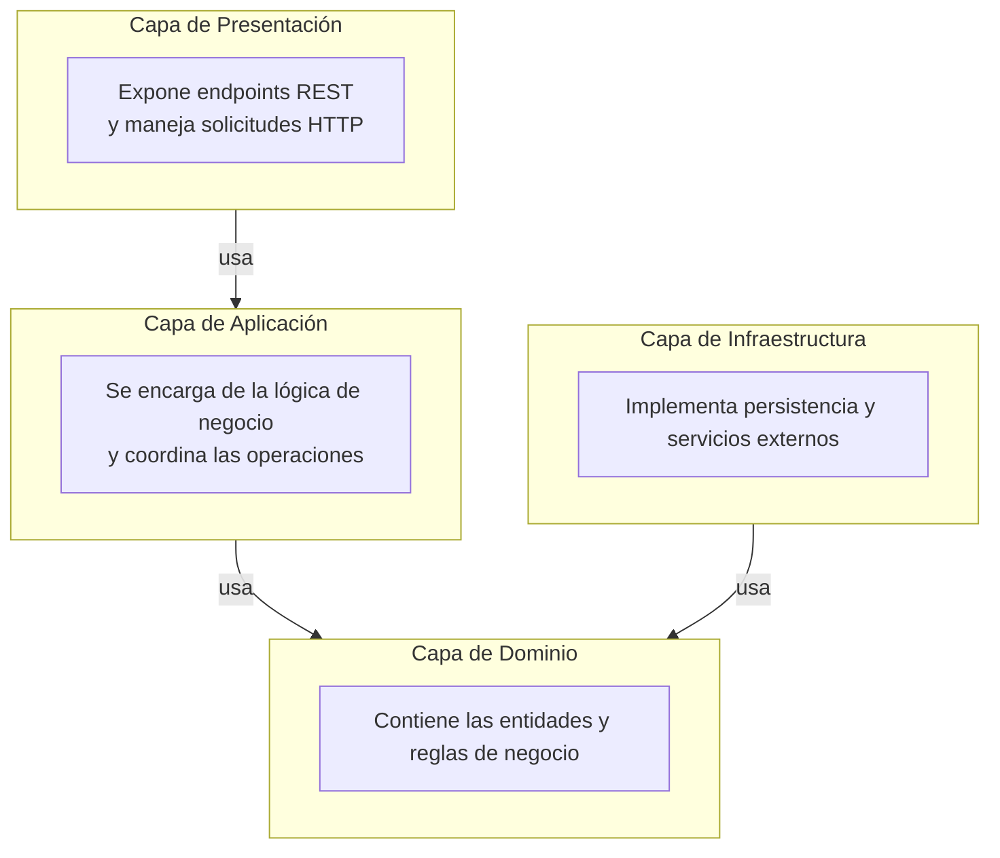

---

### Diagrama de arquitectura general con inversión de dependencias

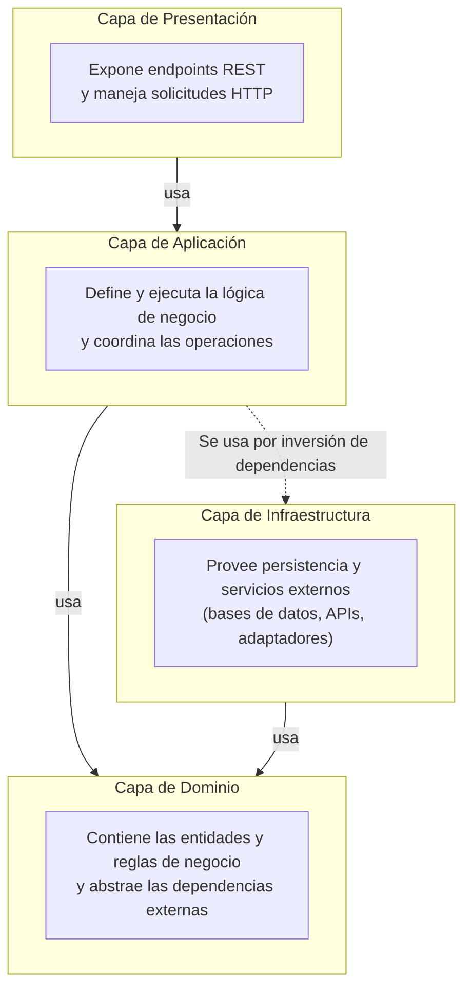
---

### Diagrama de arquitectura general con dependencias detalladas

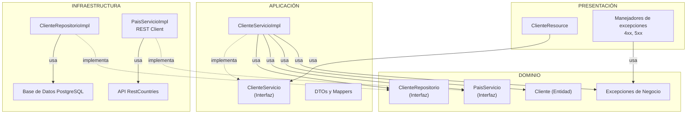
---

### Diagrama de arquitectura general con dependencias detalladas y inversión de dependencias

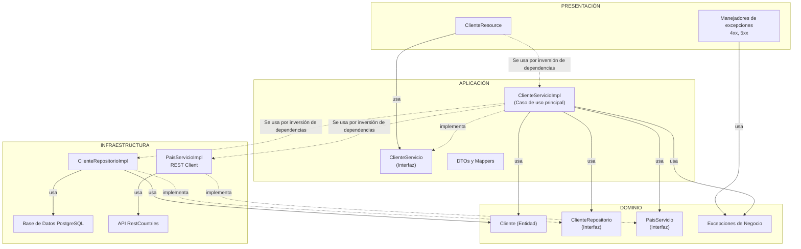
---

### Interacciones entre componentes

### Interacciones de subproceso

Las siguientes interacciones las usaremos en otras interacciones para que sean más fácil de analizar, las utilizaremos
solo llamando al método.

### Interacciones en validar correo existe (subproceso)

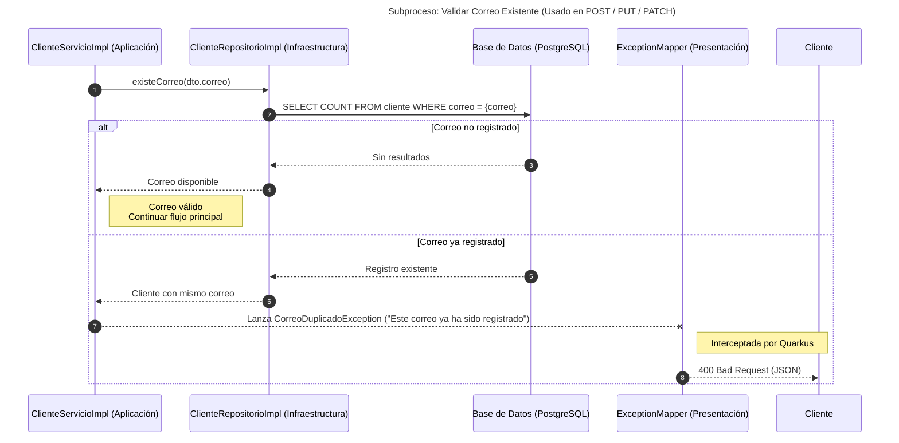
---

### Interacciones en obtener cliente por ID (subproceso)

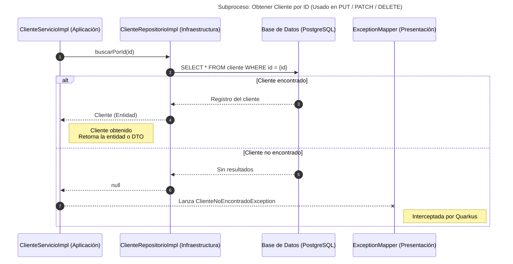
---

### Interacciones en creación de clientes

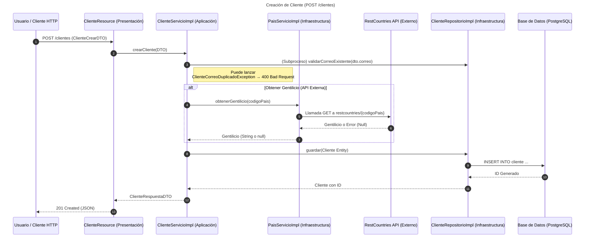
---

### Interacciones en obtener todos los clientes

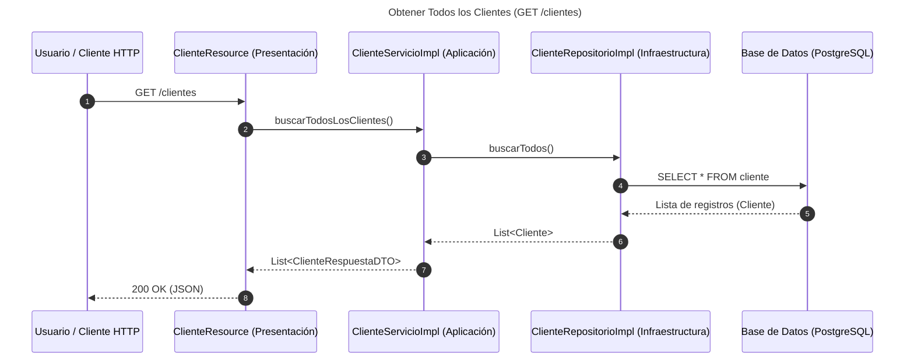
---

### Interacciones en obtener todos los clientes por país

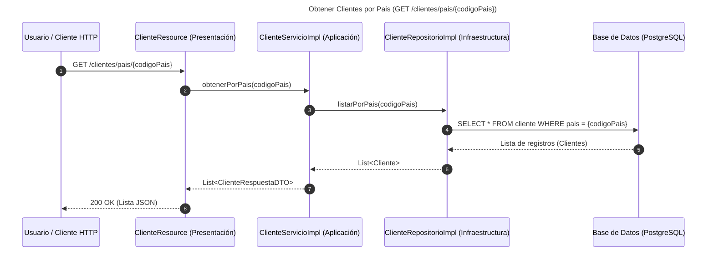
---

### Interacciones en obtener cliente por ID

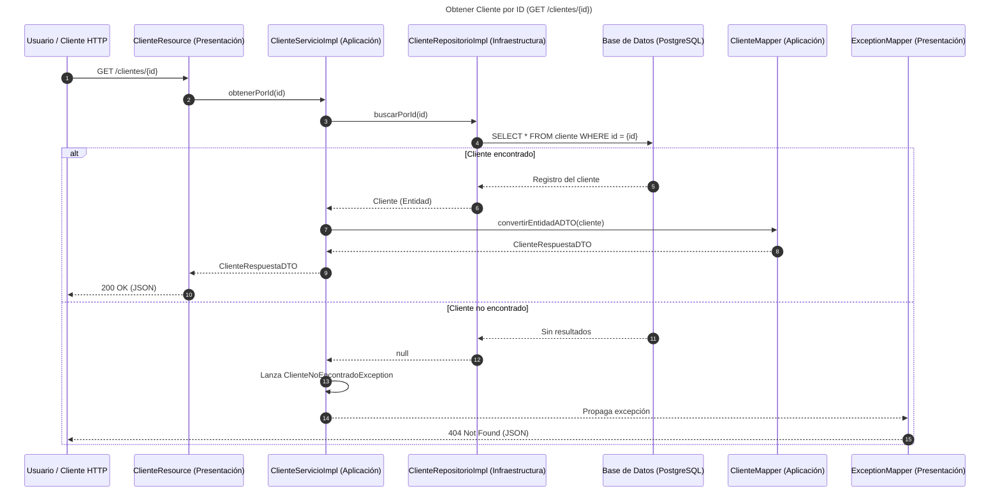
---

### Interacciones en actualizar cliente por ID

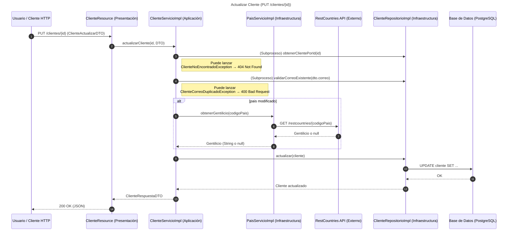
---

### Interacciones en parchear (actualizar parcial) cliente por ID

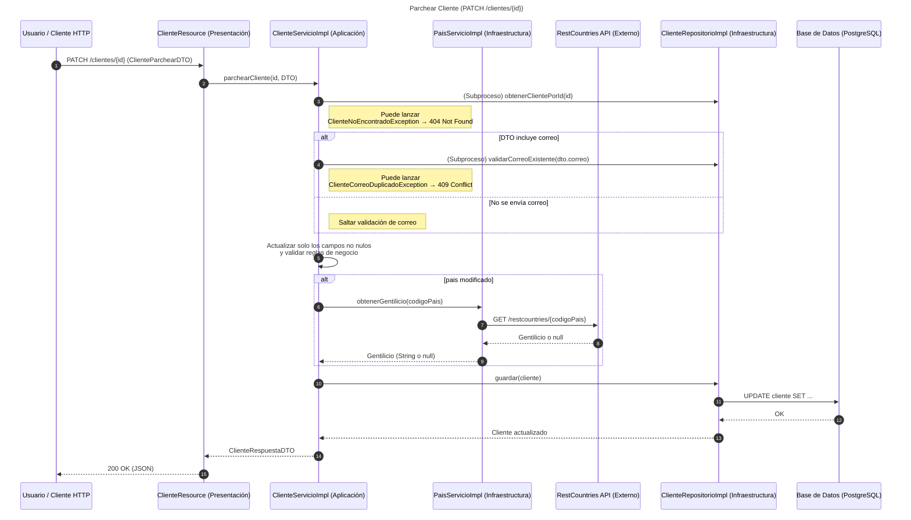
---

### Interacciones eliminar cliente por ID

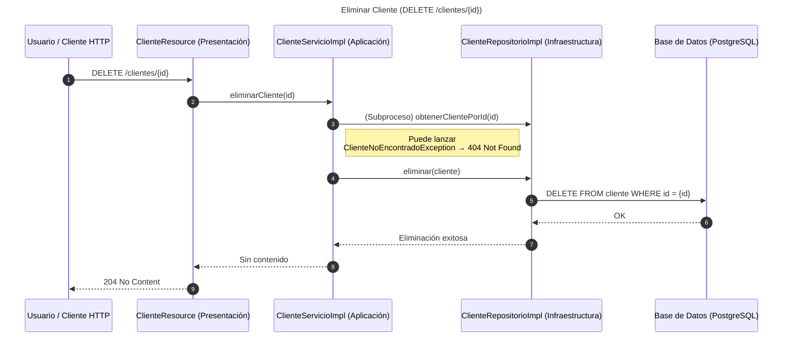
---

### Autor: Alcides Polanco German
**Fecha: 2/11/2025**


